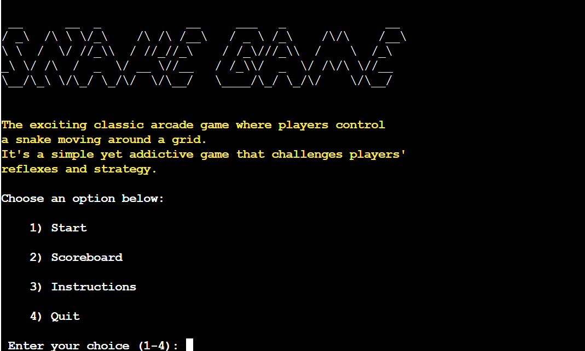
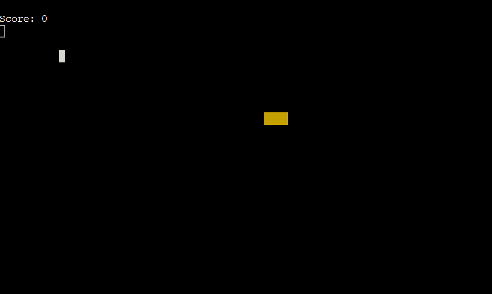
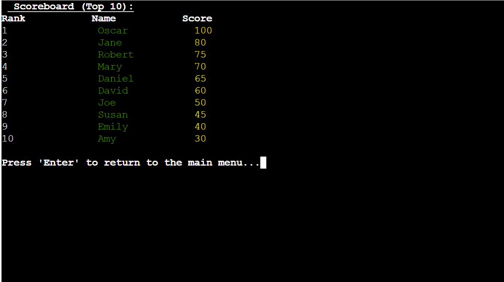
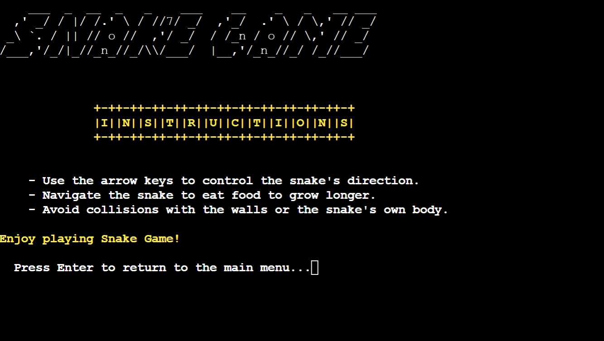
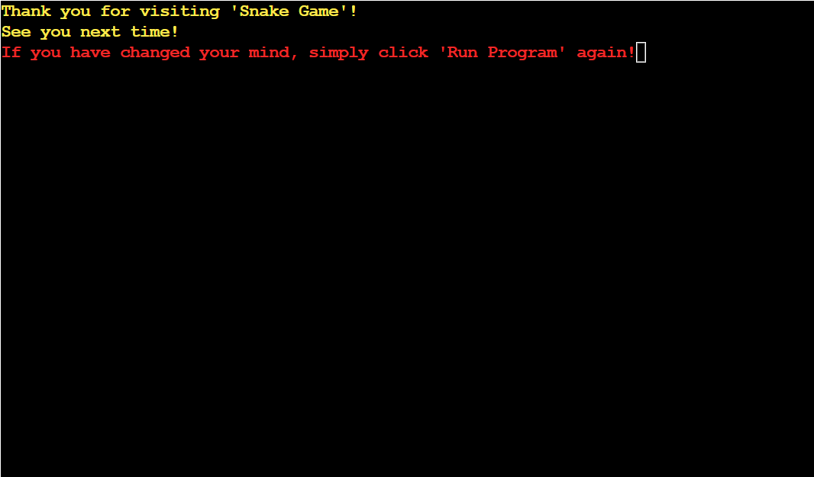
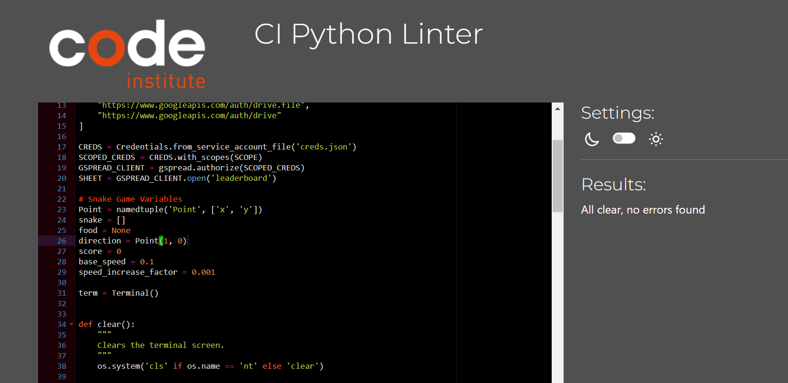

Welcome to [Snake Game!]()

Experience the nostalgia of the classic snake game in this simple yet captivating terminal-based version implemented in Python. Dive into the world of retro gaming as you navigate the snake through the maze, dodging walls and avoiding collisions with your own tail. 

## CONTENTS
- [***SNAKE GAME***](#snake-game)
    - [*CONTENTS*](#contents)
    - [*User Experience UX*](#user-experience-ux)
        - [*New Users*](#new-users)
        - [*Frequent Visitors*](#frequent-visitors)
    - [*Features*](#features)
        - [*Existing Features*](#existing-features)
        - [*Future Implementations*](#future-implementations)
    - [*Design*](#design)
        - [*Flow Chart*](#flow-chart)
    - [*Technologies Used*](#technologies-used)
        - [*Languages, Frameworks, Libraries \& Programs Used*](#languages-frameworks-libraries--programs-used)
        - [*Python Libraries*](#python-libraries)
        - [*Deployment*](#deployment)
        - [*Local Development*](#local-development)
            - [*Forking a Repository*](#forking-a-repository)
            - [*Cloning a Repository*](#cloning-a-repository)
    - [*Testing*](#testing)  
    - [*Credits*](#credits)
    - [*Acknowledgments*](#acknowledgments)

## User Experience (UX)
The user experience for this project is divided into two sections to address varying user needs and expectations: new users and frequent visitors.

#### New Users 
As a new user:
- When the game loads, I want it to be visually appealing and easy to navigate so that I can start playing immediately without the requirement of creating an account.
- The menu should be easily accessible and intuitive. 
- When starting a new game, there should be clear instructions on how to play the game and how to control the movement of the snake using arrow keys on the keyboard, so that I can navigate the snake around the game board.
-  I would like to easily access the scoreboard to view high scores,compare scores with other users or see how I'm doing compared to others.
- I would like to have the option to restart the game after it ends.

#### Frequent Visitors
As a frequent visitor:
- If I am not able to complete a level within one try, I want to be able to continue where I left off when I return.
- I want the game to remember my previous high score, so that I can track my progress and strive to beat my own record.
- Explore advanced gameplay features such as power-ups, obstacles, or different game modes to enhance the gaming experience.
- Compete with other players on the leaderboard to maintain or improve ranking position.

## Features

### Existing Features
This section of features provides easy access to different parts of the program without having to navigate through multiple sections. Each option leads to a specific function within the game:
#### Menu:
These menu options streamline the user experience, allowing players to quickly access the desired functionality of the game.

##### Start: 
The start button launches the main game screen.

##### Scoreboard
The scoreboard provides a competitive aspect to the game, motivating players to achieve higher scores and possibly earn a place among the top players.

##### Instructions
Provides players with essential information on how to play the game.

##### Quit
 It ensures a smooth and intuitive user experience by allowing users to exit the application with confidence or reconsider their decision if necessary.
 

### Future Implementations
- Implement a multiplayer mode where players can compete against each other locally or online.
- Allow users to save their progress so they  can continue from where they left off if they need to close the application unexpectedly.
- Incorporate sound effects/music to enhance the overall gaming experience.
- Introduce different levels with increasing difficulty levels and challenges to keep the gameplay engaging.

## Design
Before initiating the coding process, I designed a flowchart in Visio to ensure a clear logic path for the game.The flowchart outlines  how the program will function, starting from the main menu and progressing through the instructions, scoreboard, and quitting.

## Technologies Used

### Languages, Frameworks, Libraries & Programs Used
- [Code Institute Template](https://github.com/Code-Institute-Org/p3-template) used as a foundation for the project's frontend development.
- [Python](https://www.python.org/) was the primary programming language used to develop the snake game.
- [GitPod](https://www.gitpod.io/) was utilized for developing and testing the project within a cloud-based environment.
- [Visual Studio Code](https://code.visualstudio.com/) served as the integrated development environment (IDE) for writing and editing code.
- [GitHub](http://github.com) was used for hosting the project's code repository.
- [Heroku](http://heroku.com) was used for deploying the snake game, allowing it to be accessible and playable online through a web browser.

### Python Libraries 
- [Blessed]() - used for creating terminal-based applications and implementing the game interface.
- [Random]() - utilized for generating food positions in the game.
- [Gspread]() - used for accessing Google Sheets,storing and retrieving leaderboard data.
- [Pyfiglet]() - utilized for creating ASCII art text and for creating stylized game title.
- [Colorama]()- utilized for adding color and style to terminal text.
## Deployment
This project utilizes [Heroku](http://heroku.com) , for deployment, allowing developers to build, run, and manage applications in the cloud.
Follow these steps to deploy the Snake Game on Heroku:

1. Create a New Heroku App
- Log in to Heroku or sign up for a new account.
- Navigate to your Heroku dashboard and click on the "New" button.
- Select "Create new app" from the dropdown menu.
- Choose a unique name for your app, select a region (EU or USA), and click "Create app".
2. Configure Environment Variables
- In your app's settings, navigate to the "Config Vars" section.
- Click on "Reveal Config Vars" and add the following variables:
  - PORT: Set the value to 8000.
  - Any other confidential credentials or configuration settings required by the game.
3. Add Buildpacks
- In the "Buildpacks" section, add the following buildpacks in the specified order:
  - Python
  - Node.js
4. Prepare Required Files
- Ensure your project includes the following files:
  - requirements.txt: Contains the project's Python dependencies.
  - Procfile: Specifies the commands to run the app.
5. Connect GitHub Repository

- Under the "Deploy" tab, select "GitHub" as the deployment method.
- Connect your GitHub repository to the Heroku app.
- Enable automatic deploys for continuous deployment.
6. Deploy Your App
- Trigger a manual deployment by clicking "Deploy Branch" or wait for automatic deployments to occur.
- Once deployed successfully, your Snake Game will be accessible via the provided Heroku URL.
### Local Deployment
Install Dependencies
- Navigate to the project directory and install the required dependencies using: *pip3 install -r requirements.txt*
#### Forking a respository
1. Log in to GitHub and locate the repository that you want to fork.

2. Click on the 'Fork' button found on the top right of the repository page.

3. Select the destination where you want to fork the repository.

4. After forking is complete, you'll be redirected to your forked repository.
#### Cloning a Repository

1. On the GitHub repository page, click on the "Code" button and copy the repository URL provided.

2. Open your terminal and navigate to the directory where you want to clone the repository.

3. Use the 'git clone' command followed by the repository URL you copied and press 'Enter'

## Testing

#### Validator Testing
The [PEP8 Linter Validator](https://pep8ci.herokuapp.com/) returned the following errors:

- 33: E302 expected 2 blank lines, found 1
- 39: E302 expected 2 blank lines, found 1
- 49: E302 expected 2 blank lines, found 1
- 60: E302 expected 2 blank lines, found 1
- 74: E302 expected 2 blank lines, found 1
- 82: E302 expected 2 blank lines, found 1
- 89: E302 expected 2 blank lines, found 1
- 94: W291 trailing whitespace
- 95: W291 trailing whitespace
- 98: E302 expected 2 blank lines, found 1
- 149: E305 expected 2 blank lines after class or function definition, found 1

These errors were resolved by correcting the number of blank lines and removing trailing whitespace. After the fixes, the validator reported no errors.

## Credits
### Code
- [W3Schools](https://www.w3schools.com/) - Was a valuable resource in understanding Python.
- [Stack Overflow](https://stackoverflow.com/) - Provided answers to many questions I had about Python syntax.
- [ANSI Colors](https://talyian.github.io/ansicolors/) - The colors used were inspired by the ANSI Colors library, which provides a convenient way to add colors and styling to terminal output in Python.
- [Slack Community](https://app.slack.com/) - Special 'thanks' to the Slack Community for providing valuable advice and support throughout the development process.
- [Medium - Step-by-Step Guide: Python Code for Snake Game Development](https://medium.com/@wepypixel/step-by-step-guide-python-code-for-snake-game-development-3e0ec9f7522e): The step-by-step guide provided on this website served as valuable inspiration.
- [YouTube Tutorial](https://www.youtube.com/watch?v=CD4qAhfFuLo&t=356s) provided inspiration and guidance during the project.
### Acknowledgements

- [Code Institute](https://learn.codeinstitute.net/ci_program/diplomainfullstacksoftwarecommoncurriculum): The Code Institute's educational materials and Python lessons were immensely helpful in guiding the development and deployment of the game.
- [Slack Community](https://app.slack.com/): Special thanks to the Slack Community for providing valuable advice and support throughout the development process.

