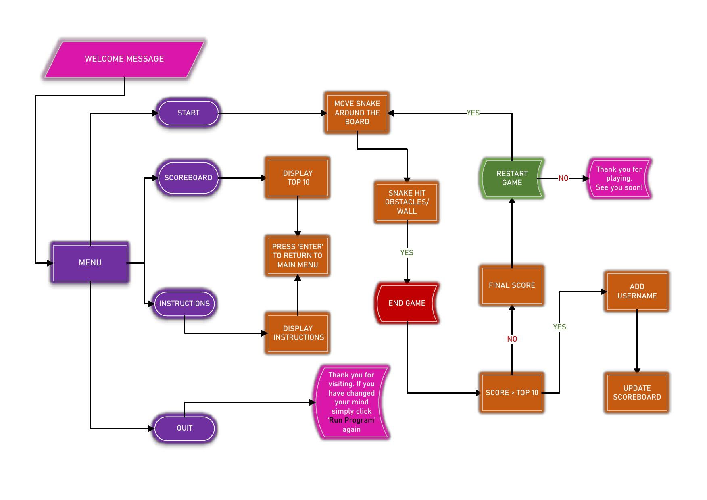

## [SNAKE GAME]
Welcome to Snake Game!

Experience the nostalgia of the classic snake game in this simple yet captivating terminal-based version implemented in Python. Dive into the world of retro gaming as you navigate the snake through the maze, dodging walls and avoiding collisions with your own tail. 

## CONTENTS
- [***SNAKE GAME***](#snake-game)
    - [*CONTENTS*](#contents)
    - [*User Experience UX*](#user-experience-ux)
        - [*New Users*](#new-users)
        - [*Frequent Visitors*](#frequent-visitors)
    - [*Features*](#features)
        - [*Existing Features*](#existing-features)
        - [*Future Implementations*](#future-implementations)
    - [*Design*](#design)
        - [*Flow Chart*](#flow-chart)
    - [*Technologies Used*](#technologies-used)
        - [*Languages, Frameworks, Libraries \& Programs Used*](#languages-frameworks-libraries--programs-used)
        - [*Python Libraries*](#python-libraries)
        - [*Deployment*](#deployment)
        - [*Local Development*](#local-development)
            - [*Forking a Repository*](#forking-a-repository)
            - [*Cloning a Repository*](#cloning-a-repository)
    - [*Testing*](#testing)
        - [*Validator Testing*](#validator-testing)
        - [*Manual Testing*](#manual-testing)
    - [*Credits*](#credits)
        - [*Code Used*](#code-used)
    - [*Acknowledgments*](#acknowledgments)

## User Experience (UX)
The user experience for this project is divided into two sections to address varying user needs and expectations: new users and frequent visitors.

#### New Users 
As a new user:
- When the game loads, I want it to be visually appealing and easy to navigate so that I can start playing immediately without the requirement of creating an account.
- The menu should be easily accessible and intuitive. 
- When starting a new game, there should be clear instructions on how to play the game and how to control the movement of the snake using arrow keys on the keyboard, so that I can navigate the snake around the game board.
-  I would like to easily access the scoreboard to view high scores,compare scores with other users or see how I'm doing compared to others.
- I would like to have the option to restart the game after it ends.

#### Frequent Visitors
As a frequent visitor:
- If I am not able to complete a level within one try, I want to be able to continue where I left off when I return.
- I want the game to remember my previous high score, so that I can track my progress and strive to beat my own record.
- Explore advanced gameplay features such as power-ups, obstacles, or different game modes to enhance the gaming experience.
- Compete with other players on the leaderboard to maintain or improve ranking position.

## Features

### Existing Features
This section of features provides easy access to different parts of the program without having to navigate through multiple sections. Each option leads to a specific function within the game:
#### Menu:
These menu options streamline the user experience, allowing players to quickly access the desired functionality of the game.

##### Start: 
##### Scoreboard
The scoreboard provides a competitive aspect to the game, motivating players to achieve higher scores and possibly earn a place among the top players.

##### Instructions
Provides players with essential information on how to play the game.

##### Quit
 It ensures a smooth and intuitive user experience by allowing users to exit the application with confidence or reconsider their decision if necessary.

### Future Implementations
- Implement a multiplayer mode where players can compete against each other locally or online.
- Allow users to save their progress so they  can continue from where they left off if they need to close the application unexpectedly.
- Incorporate sound effects/music to enhance the overall gaming experience.
- Introduce different levels with increasing difficulty levels and challenges to keep the gameplay engaging.

## Design
Before initiating the coding process, I designed a flowchart in Visio to ensure a clear logic path for the game.The flowchart outlines  how the program will function, starting from the main menu and progressing through the instructions, scoreboard, and quitting.

## Technologies Used

### Languages, Frameworks, Libraries & Programs Used
- [Code Institute Template](https://github.com/Code-Institute-Org/p3-template) used as a foundation for the project's frontend development.
- [Python](https://www.python.org/) was the primary programming language used to develop the snake game.
- [GitPod](https://www.gitpod.io/) was utilized for developing and testing the project within a cloud-based environment.
- [Visual Studio Code](https://code.visualstudio.com/) served as the integrated development environment (IDE) for writing and editing code.
- [GitHub](http://github.com) was used for hosting the project's code repository.
- [Heroku](http://heroku.com) was used for deploying the snake game, allowing it to be accessible and playable online through a web browser.

### Python Libraries 
- [Blessed]() - used for creating terminal-based applications and implementing the game interface.
- [Random]() - utilized for generating food positions in the game.
- [Gspread]() - used for accessing Google Sheets,storing and retrieving leaderboard data.
- [Pyfiglet]() - utilized for creating ASCII art text and for creating stylized game title.
- [Colorama]()- utilized for adding color and style to terminal text.